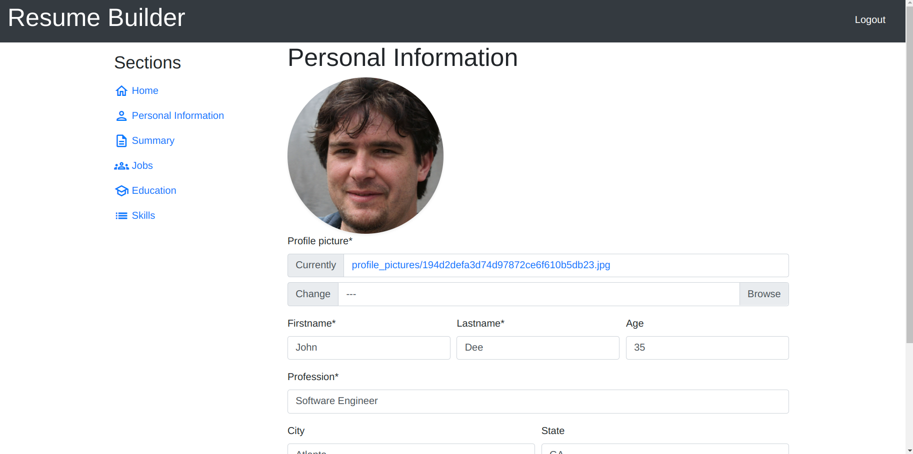
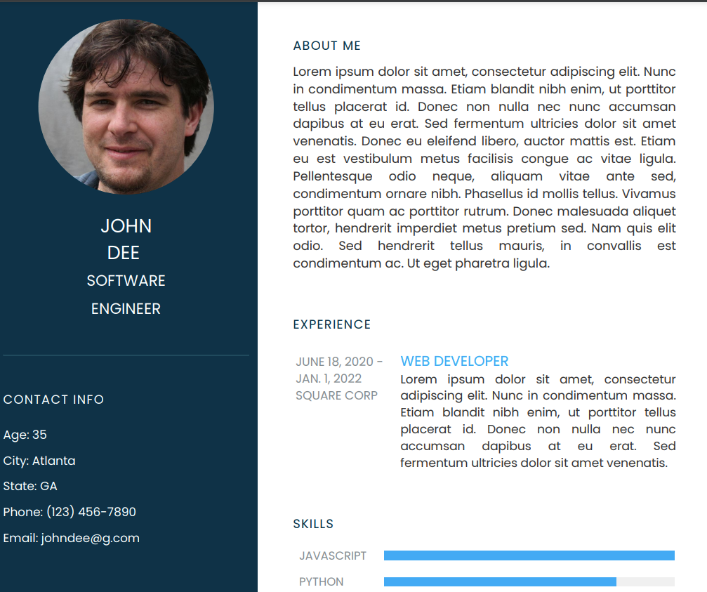

# Resume Builder



Django project made with the intent of speeding the task of creating professional resumes. It helps you to generate different resumes for different types of jobs that requires different qualifications, skills and experience. As an example, if you may be open to both software engineer and data scientist positions, as these are two different roles that require specific skills and experience, it’s better to have a resume for each!  

This project helps you with the task of creating them. Made using Bootstrap for a beautiful and intuitive UI and a backend built with Django for fast processing, scalability and rapid development, together with HTMX for using modern browser features directly from HTML. It allows you to create multiple resumes by just typing out your info and letting it generate a resume in pdf format for you. 




# Technologies

Project is created with

- Python
- Html
- Css
- Django
- Htmx
- Bootstrap

# To do

- Write more tests
- Add more resume templates

# Running

```
$ pip install -r requirements.txt
$ python manage.py makemigrations
$ python manage.py migrate
$ python manage.py runserver
```
